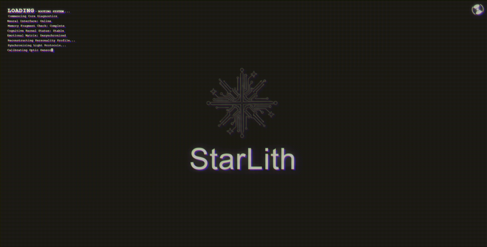
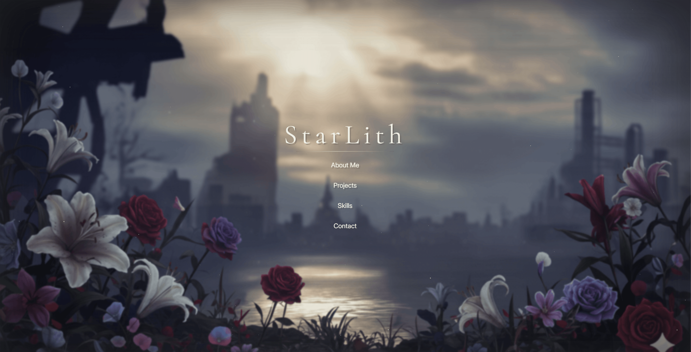
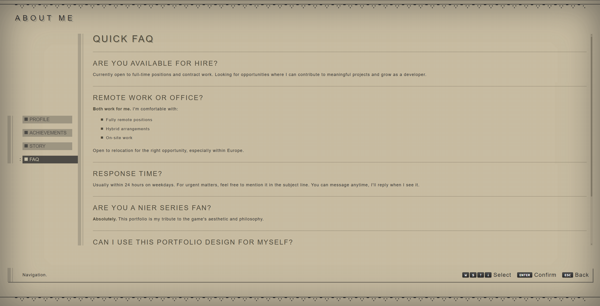

# NieR: Automata Style Resume

A sleek, interactive resume website inspired by the UI/UX design of NieR: Automata. Built with Angular 20 and fully customizable through markdown files and JSON configuration.


---

---


## ✨ Features

- 🎮 **NieR: Automata inspired UI** - Authentic game-style interface with retro-futuristic design
- 📝 **Markdown-based content** - Easy content management through `.md` files
- ⚙️ **JSON configuration** - Dynamic menu sections controlled by simple config files
- 🎹 **Keyboard navigation** - Full keyboard support (W/S/Arrow keys, Enter, Esc)
- 📱 **Responsive design** - Works seamlessly across different screen sizes
- 🚀 **Easy deployment** - Separate development and production configurations
- 🎨 **Customizable** - Simple to adapt for your own portfolio

## 🗂️ Project Structure

```
├── src/
│   ├── components/
│   │   ├── loading/
│   │   ├── home/
│   │   ├── aboutme/
│   │   ├── projects/
│   │   ├── skills/
│   │   └── contact/
│   ├── assets/
│   │   ├── example/          # Example content for development
│   │   │   ├── data/
│   │   │   │   ├── aboutme.config.json
│   │   │   │   ├── projects.config.json
│   │   │   │   ├── skills.config.json
│   │   │   │   └── contact.config.json
│   │   │   └── content/
│   │   │       ├── aboutme/
│   │   │       │   ├── profile.md
│   │   │       │   ├── achievements.md
│   │   │       │   ├── story.md
│   │   │       │   └── faq.md
│   │   │       ├── projects/
│   │   │       ├── skills/
│   │   │       └── contact/
│   │   └── prod/             # Production content (create this)
│   └── environments/
│       ├── environment.ts
│       └── environment.prod.ts
```

## 🚀 Quick Start

### Prerequisites

- Node.js (v18 or higher)
- npm or yarn

### Installation

```bash
# Clone the repository
git clone https://github.com/SamuiRo/StarLith.git
cd StarLith

# Install dependencies
npm install
```

### Development

```bash
# Run development server with example content
npm run start

# Run development server with production content
npm run start:prod
```

Navigate to `http://localhost:4200/`

### Build

```bash
# Build for development (uses example content)
npm run build

# Build for production (uses prod content)
npm run build:prod
```

## 📝 Content Customization

### Step 1: Create Production Content Folder

Create a `prod` folder inside `src/assets/`:

```bash
mkdir -p src/assets/prod/data
mkdir -p src/assets/prod/content/aboutme
mkdir -p src/assets/prod/content/projects
mkdir -p src/assets/prod/content/skills
mkdir -p src/assets/prod/content/contact
```

### Step 2: Copy and Customize Configuration Files

Copy the example config files to your prod folder:

```bash
cp src/assets/example/data/*.json src/assets/prod/data/
```

**Configuration Structure:**

Each section (About Me, Projects, Skills, Contact) has a `config.json` file that defines the submenu items:

```json
[
  {
    "id": "unique-id",
    "title": "Display Title",
    "contentFile": "filename.md"
  }
]
```

**Example - `aboutme.config.json`:**

```json
[
  {
    "id": "profile",
    "title": "Profile",
    "contentFile": "profile.md"
  },
  {
    "id": "achievements",
    "title": "Achievements",
    "contentFile": "achievements.md"
  }
]
```

### Step 3: Create Your Markdown Content

Create `.md` files in the respective content folders:

**Example - `src/assets/prod/content/aboutme/profile.md`:**

```markdown
# John Doe

## Full-Stack Developer

Passionate developer with 5+ years of experience in building modern web applications.

### Current Focus
- Cloud Architecture
- DevOps Practices
- Modern Frontend Frameworks
```

### Step 4: Customize All Sections

Repeat the process for:
- **Projects** (`src/assets/prod/content/projects/`)
- **Skills** (`src/assets/prod/content/skills/`)
- **Contact** (`src/assets/prod/content/contact/`)

## ⌨️ Keyboard Controls

| Key | Action |
|-----|--------|
| `W` / `↑` | Navigate up |
| `S` / `↓` | Navigate down |
| `Enter` | Confirm selection |
| `Esc` | Go back / Return to home |

## 📦 NPM Scripts

```json
{
  "start": "ng serve",
  "start:prod": "ng serve --configuration production",
  "build": "ng build",
  "build:prod": "ng build --configuration production",
  "test": "ng test",
  "lint": "ng lint"
}
```

## 🎨 Sections Overview

### 1. Loading Screen
Initial loading animation with NieR-style aesthetics.

### 2. Home
Main navigation hub with links to all sections.

### 3. About Me
- **Configurable subsections** via `aboutme.config.json`
- Example sections: Profile, Achievements, Story, FAQ
- Markdown-based content

### 4. Projects
- **Dynamic project cards** via `projects.config.json`
- Showcase your portfolio projects
- Each project in separate markdown file

### 5. Skills
- **Categorized skills** via `skills.config.json`
- Example categories: Frontend, Backend, Cloud, Automation
- Easy to add new skill categories

### 6. Contact
- **Contact information** via `contact.config.json`
- Social links and contact details
- Markdown formatted

## 🔮 Planned Features

If this project gains popularity, the following improvements are planned:

- [ ] **How To Free Host** - Clear instructions on how to host for free on Firebase and other resources
- [ ] **Enhanced Content Structure** - Improved folder organization for easier content management
- [ ] **Full Configuration Export** - Move all hardcoded content to configuration files
- [ ] **Component Optimization** - Refactor shared component logic to reduce code duplication
- [ ] **Style Optimization** - Improve CSS architecture and reduce bundle size
- [ ] **Theme Customization** - Easy color scheme and styling customization
- [ ] **Animation Controls** - Toggle animations on/off for performance
- [ ] **Multi-language Support** - i18n implementation for content localization
- [ ] **Content Management UI** - Visual editor for non-technical users

## 🛠️ Technology Stack

- **Framework:** Angular 20
- **Styling:** SCSS
- **Animations:** animejs
- **Markdown:** ngx-markdown
- **Routing:** Angular Router
- **HTTP Client:** Angular HttpClient

## 📄 License

MIT License - feel free to use this template for your own portfolio!

## 🤝 Contributing

Contributions are welcome! Please feel free to submit a Pull Request.

1. Fork the project
2. Create your feature branch (`git checkout -b feature/AmazingFeature`)
3. Commit your changes (`git commit -m 'Add some AmazingFeature'`)
4. Push to the branch (`git push origin feature/AmazingFeature`)
5. Open a Pull Request

## 💬 Support

If you have any questions or run into issues, please open an issue on GitHub.

## ⭐ Show Your Support

If you like this project, please give it a star on GitHub!

---

**Made with ❤️ and inspired by NieR: Automata**